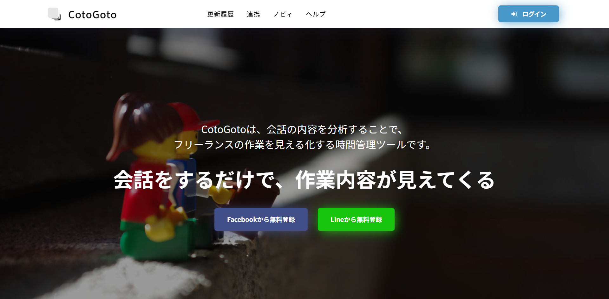

# feature-requests
CotoGotoは、会話の内容を分析することで、 フリーランスの作業を見える化する時間管理ツールです。

# 会話からはじめるフリーランスのための自己管理サービス ・ CotoGoto(コトゴト)

> このリポジトリは、[CotoGoto(コトゴト)](https://www.cotogoto.ai/)の機能リクエストや開発状況をまとめる目的で運用されています。

- [CotoGotoの開発状況はこちら](https://github.com/orgs/cotogoto/projects/1?fullscreen=true)

]

## GitHub アカウントをお持ちの方へ

[Issues](https://github.com/cotogoto/feature-requests/issues)にて、以下を受け付けています。

- **機能リクエスト**: どんな機能? どんなユーザ向け? など記入
- **バグ報告**: バグの発生するURL、発生状況など記入

※質問についてはお受けできませんので、[Facebookグループ](https://www.facebook.com/cotogotoAI/)の方にお願いします。

